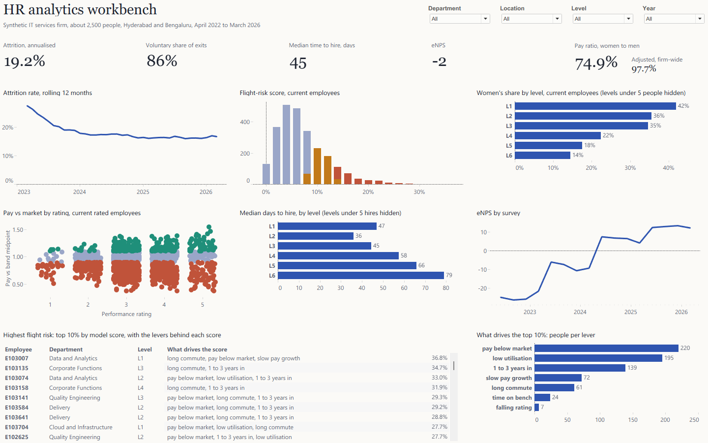

# HR Analytics

An end-to-end people-analytics case study: four years of synthetic HR records for an Indian IT services firm, modelled and tested in DuckDB, a flight-risk model held to a fairness check, and a Tableau workbench generated entirely from code.

**[Open the live workbench on Tableau Public](https://public.tableau.com/app/profile/daman.reddy/viz/HRAnalyticsWorkbench/Workbench)**

**[Read the full case study (PDF)](docs/case-study.pdf)**, or the [web version](docs/case-study.html) for a portfolio site.
Reviewing the code? Start with **[How it works](docs/how-it-works.pdf)**, a stage-by-stage guide with the design choices worth challenging.



## What it answers

| Question | Where |
|---|---|
| How fast are we losing people, and is it getting better? | Attrition KPI, rolling 12-month attrition trend |
| Which leavers hurt? | Voluntary share, regretted exits (case study) |
| Are we paying fairly? | Raw and adjusted pay ratio, pay against band by rating, women's share by level |
| How long does hiring take? | Median days to hire, by level |
| How do people feel? | eNPS by survey |
| Who is likely to go next, and why? | Flight-risk distribution, top 10% with their levers, people per lever |

Four filters (department, location, level, year) drive every view.

## Headline findings (synthetic company)

- Attrition fell from 27.6% (FY 2022-23) to 16.8% (FY 2025-26).
- "Better pay" is the top resignation reason (507 of 1,467); a third of employees are paid below their market band.
- Of the 253 people in the top 10% of flight risk, 220 are paid below market and 195 have low utilisation.
- Women earn 74.9% of men's median pay, 97.7% like for like (95% interval 96.1% to 99.3%): most of the gap is that few women reach senior levels.
- eNPS rose from −25 to +13 over the four years.
- The flight-risk model (gradient boosting, out-of-time test) reaches ROC AUC 0.658; its top 10% of scores catch 20.4% of leavers.

## How it's built

```
src/generate.py          seeded generator: 9 HRIS, ATS, timesheet and survey exports
sql/01_staging.sql       typed staging
sql/02_model.sql         month and employee dimensions, monthly employee snapshot (point-in-time ASOF joins)
sql/03_features.sql      quarterly model snapshots, six-month resignation label, feature list
src/model.py             flight-risk model, calibration, fairness, drivers, pay-equity regression
sql/04_marts.sql         report tables, rolling 12-month rates, one long table for Tableau
sql/checks.sql           15 checks; the export is blocked if any fails
src/pipeline.py          builds DuckDB, trains the model, runs the checks, exports 12 tables to data/model
tableau/build_twb.py     generates the Tableau workbook (.twbx with a Hyper extract) from the schema
tableau/filter_check.py  expected dashboard numbers for any filter combination, computed in DuckDB
tableau/*.ps1            open, capture and crop helpers for Tableau Public
```

Every number is checked twice: the SQL checks reconcile the data (headcount roll-forward, movements against source, rolling rates, ATS against HRIS, model hygiene), and the workbench's numbers were compared with DuckDB for the whole firm and three filtered views.

## Run it

Requirements: Python 3.12+, Tableau Public 2026.2 (free; Windows tested).

```bash
python -m venv .venv
.venv/Scripts/pip install -r requirements.txt
.venv/Scripts/python src/generate.py
.venv/Scripts/python src/pipeline.py
.venv/Scripts/python tableau/build_twb.py
```

Then open `tableau/HR Analytics Workbench.twbx` in Tableau Public. The data travels inside the file.

## Data

All data is synthetic: the company, its people, salaries and survey responses are generated. Gender, age, home region and university tier are never model features; caste and religion are not modelled at all. No real employee data is used.
